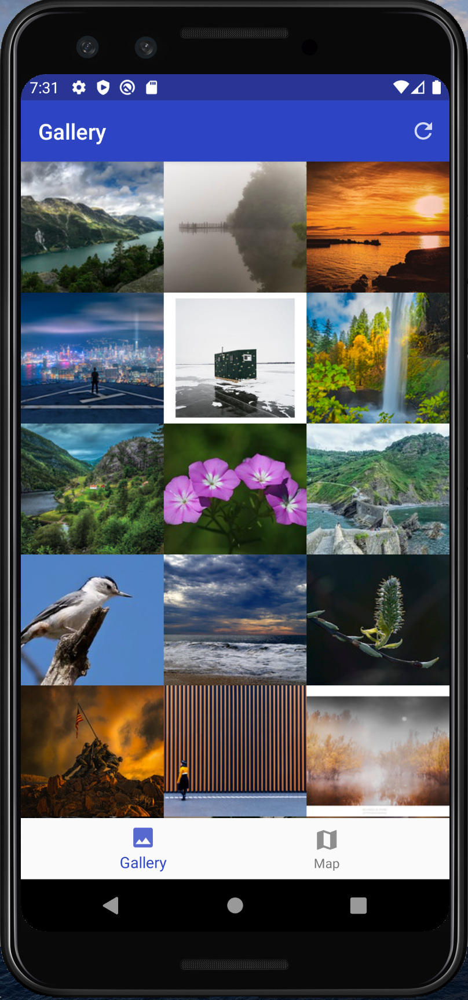
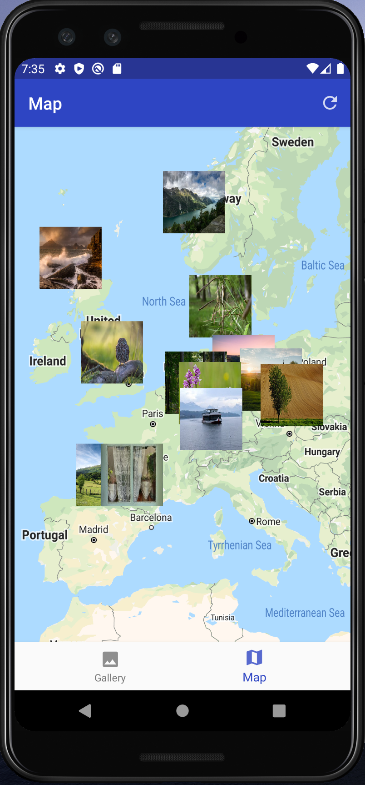
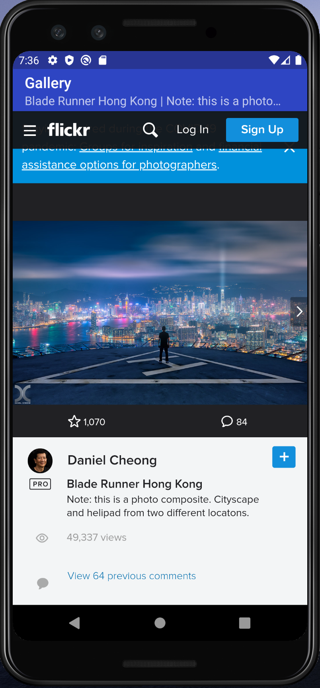

# Picture Gallery
- An Android app built using Kotlin that utilizes the Flickr API and RetroFit to handle HTTP requests.
- It display photos from Flickr in both a grid view and a map view.
- The map view that  your photos on a map of the world based on the GPS data in those photos. 
- It also has a bottom navigation bar that allows you to switch between the gallery and the map views.
- Clicking on a photo in either view will take you to flickr page(webview) for that image.
- The reload button on the top right allows you to fetch new photos ( when available ).

        

